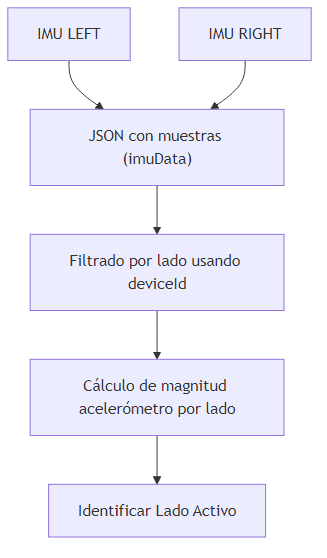
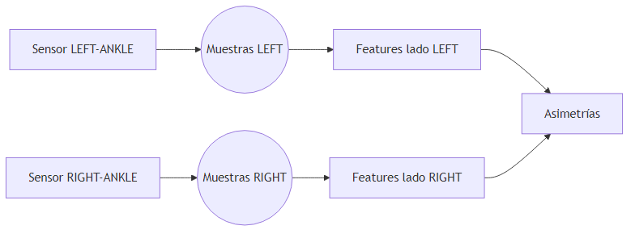

 # Documentación de variables, adquisición de datos y protocolos

 Este documento describe en detalle: las variables que analiza la app, cómo se adquieren los datos, el flujo de procesamiento y el protocolo de los ejercicios actualmente soportados (`stomp` y `tapping`).

 ---

 ## 1) Adquisición de datos

 - **Sensores**: IMU colocadas en ambas extremidades inferiores (Punta de pies,tobillos). En los datos de ejemplo aparecen identificadores como `LEFT-ANKLE`, `RIGHT-ANKLE` en el campo `deviceId`.
 - **Señales registradas por muestra**:
   - `timestamp` (unidad heredada del origen de datos; en los datasets actuales parece estar en milisegundos; confirmar en hardware final).
   - `accelerometer` con ejes `x`, `y`, `z` (unidades: g o m/s²; confirmar según firmware).
   - `gyroscope` con ejes `x`, `y`, `z` (unidades: °/s o rad/s; confirmar según firmware).
 - **Formato de archivo**: JSON, con la lista de muestras disponible bajo una clave de nivel superior (p. ej. `imuData`). Ejemplo:

 ```json
 {
   "timestamp": 33598,
   "deviceId": "RIGHT-ANKLE",
   "accelerometer": { "x": -0.19, "y": -0.17, "z": 0.21 },
   "gyroscope":     { "x":  2.93,  "y": -7.50, "z": -35.4 }
 }
 ```

 - **Asignación de lado**: se usa `deviceId` para agrupar muestras en `LEFT` y `RIGHT`.
 - **Elección de lado activo**: se calcula la magnitud media del acelerómetro por lado y se etiqueta como lado activo el de mayor magnitud media.

 Diagrama del flujo de adquisición y procesamiento inicial:

 

 ---

 ## 2) Flujo de procesamiento y cálculo de variables

 - El script principal `main.py`:
   1) Carga muestras desde `data/<ejercicio>/*.json`.
   2) Agrupa por lado `LEFT`/`RIGHT`.
   3) Determina el `lado_activo` usando acelerómetro.
   4) Extrae features por lado con `preprocessing/feature_extraction.py` (a partir del giroscopio).
   5) Calcula asimetrías entre lados.
   6) Exporta un CSV en `resultados/resultados.csv`.

 - La extracción de features usa el giroscopio:
   - Magnitud de giroscopio por muestra: \( |\omega| = \sqrt{\omega_x^2 + \omega_y^2 + \omega_z^2} \).
   - Detección de picos con `scipy.signal.find_peaks` (parámetros por defecto: `altura_min = 0.2`, `distancia_min = 5`).
   - A partir de los índices de picos y de `timestamp` se calculan intervalos y métricas.

 Diagrama del cálculo de features por lado:

 

 ---

 ## 3) Variables exportadas al CSV

 Columnas actuales en `resultados/resultados.csv`:

 - `archivo`: nombre del archivo procesado.
 - `ejercicio`: tipo de ejercicio (`stomp` o `tapping`).
 - `lado_activo`: lado con mayor magnitud media de aceleración.

 Variables por lado (prefijos `activo_` y `pasivo_`):

 - `n_peaks`:
   - Conteo de picos de la magnitud del giroscopio.
   - Interpretación: mayor número puede reflejar mayor número de oscilaciones/movimientos discretos.

 - `mag_prom`:
   - Promedio de magnitud del giroscopio en los picos detectados.
   - Interpretación: intensidad rotacional típica de los eventos.

 - `mag_max`:
   - Máxima magnitud del giroscopio en los picos detectados.
   - Interpretación: evento de mayor intensidad rotacional.

 - `ritmo_prom`:
   - Promedio de intervalos entre picos: \( \overline{\Delta t} = \frac{1}{N-1} \sum_{i=1}^{N-1} (t_{p_{i+1}} - t_{p_i}) \).
   - Unidades: las de `timestamp` (actualmente ms; confirmar).
   - Interpretación: cuanto menor el valor, mayor cadencia de movimientos.

 - `ritmo_var`:
   - Desviación estándar de los intervalos entre picos: \( \sigma_{\Delta t} \).
   - Interpretación: variabilidad del ritmo; valores altos sugieren irregularidad.

 - `fatiga`:
   - Cambio relativo entre la magnitud media de picos en la primera y segunda mitad:
     \[ \text{fatiga} = \frac{\overline{M}_{1\,\text{mitad}} - \overline{M}_{2\,\text{mitad}}}{\overline{M}_{1\,\text{mitad}}} \]
   - Rango interpretativo: cercano a 0 indica estabilidad; positivo indica descenso (posible fatiga); negativo indica incremento de intensidad. Valores extremos pueden indicar ruido o segmentación inadecuada.

 Asimetrías entre lados:

 - `asimetria_mag`:
   - Diferencia relativa entre `mag_prom` de activo y pasivo:
     \[ \text{asimetria\_mag} = \frac{|\text{mag\_prom}_{act} - \text{mag\_prom}_{pas}|}{\max(\text{mag\_prom}_{act}, \text{mag\_prom}_{pas})} \]
   - Rango: \([0, 1]\). Valores cercanos a 1 implican alta asimetría.

 - `asimetria_ritmo`:
   - Diferencia relativa entre `ritmo_prom` de activo y pasivo, con misma fórmula anterior.

 Notas importantes:
 - La selección de `lado_activo` usa acelerómetro; las métricas por lado usan giroscopio.
 - No se aplica filtrado previo; si se observa ruido, considerar filtros (mediana, pasa-bajas) antes de detectar picos.

 ---

 ## 4) Protocolos de ejercicios

 Protocolos propuestos para captura consistente. Ajustar/validar según criterio clínico:

 ### 4.1 Stomp (golpe de pie)
 - Posición: sentado, pies separados al ancho de hombros.
 - Instrucción: golpear el suelo con la punta de un pie de forma marcada y repetir a cadencia cómoda; alternar si se solicita bilateral.
 - Duración : 10 repeticiones.
 - Consideraciones:
   - Mantener el otro pie estable para aislar el gesto.
   - Registrar al menos 10–15 eventos útiles por lado.

 ### 4.2 Tapping (toques rápidos del pie)
 - Posición: sentado , sin desplazar el talón si se busca gestualidad de tobillo.
 - Instrucción: realizar toques rápidos con la punta del pie al máximo ritmo sostenible.
 - Duración : 10 repeticiones.
 - Consideraciones:
   - Evitar movimientos compensatorios del tronco.
   - Priorizar regularidad del ritmo.

 ### 4.3 Colocación de sensores
 - Lados: `LEFT` y `RIGHT`.
 - Ubicación sugerida: cara lateral o anterior del tobillo (coincide con ejemplos `*-ANKLE`).
 - Fijación: firme para minimizar vibraciones parásitas.

 

 ---

 ## 5) Ejecución y salida

 - Generación de CSV:
   - `python main.py` → crea `resultados/resultados.csv` con todas las variables descritas.
 - Visualización de aceleración X/Y/Z por lado:
   - `python preprocessing/acceleration_visualizer.py` (ajustar la ruta del archivo en la última línea si se desea).

 ---

 ## 6) Parámetros y supuestos a confirmar

 - Unidades de `timestamp` (ms vs s) y unidades de acelerómetro/giroscopio según firmware.
 - Parámetros de detección de picos (`altura_min`, `distancia_min`) pueden necesitar ajuste por ejercicio/sujeto.
 - Si se añaden nuevos ejercicios, incluir carpeta en `data/<ejercicio>` y registrar el nombre en `main.py`.

 ---

 ## 7) Referencia a código

 - `main.py`: orquestación, selección de lado activo, generación de CSV.
 - `preprocessing/feature_extraction.py`: detección de picos y features de giroscopio.
 - `preprocessing/acceleration_visualizer.py`: gráficas de aceleración X/Y/Z por lado.


